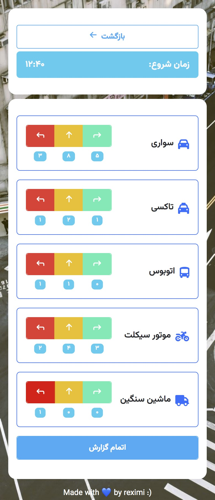

# Charrah Bin

Four-way traffic tracking system (based on vehicle type).

## Demo
https://charrah-bin.onrender.com/

### Four-way Info


### Tracking Vehicles Traffic


### Download Report


### Report Sheet Demo


## Run Locally

Make sure you have python installed.

-  Clone the project:

```bash
  git clone https://github.com/rexa222/charrah-bin.git
```

- Install requirements:

```bash
  pip install -r requirements.txt
```

- Run the API app:

```bash
  py app.py
```

project should be accessible locally at http://127.0.0.1:5000


## Frontend

Project templates are styled using [Bootstrap](https://getbootstrap.com/) framework.


## License

[MIT](https://choosealicense.com/licenses/mit/)
